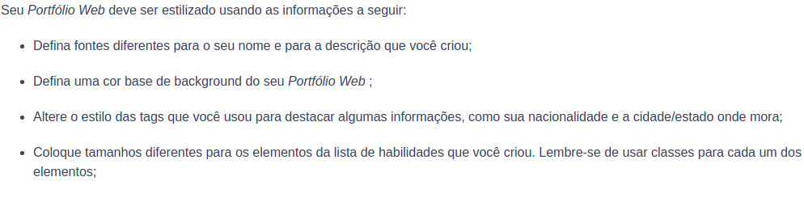

<h1 align="center">Bloco 3 Dia 2: HTML & CSS - Primeiros passos em CSS </h1>

  <a href="#exercicio">Exercícios do dia</a>&nbsp;&nbsp;|&nbsp;&nbsp;
  <a href="#descricao">Descrição dos exercícios</a>

 
<h2 id="exercicio">Exercícios do dia:</h2>

<li><a href="#styleCss">Começo da customização do portifólio usando o Css.</a></li>
 

<h2 id="descricao">Descrição dos exercícios do dia:</h2>

<li id="styleCss"><a href="style.css">Começo da customização do portifólio usando o Css.</a></li>

A atividade trata-se da customização do HTML criado no dia 1 do bloco 3 através de códigos Css nos seguintes requisitos:

