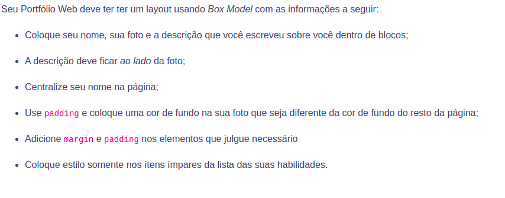

<h1 align="center">Bloco 3 Dia 3: HTML & CSS - Seletores e posicionamento </h1>

  <a href="#exercicio">Exercícios do dia</a>&nbsp;&nbsp;|&nbsp;&nbsp;
  <a href="#descricao">Descrição dos exercícios</a>

 
<h2 id="exercicio">Exercícios do dia:</h2>

<li><a href="#styleCss">Aprimorando a customização utilizando o Css.</a></li>
 

<h2 id="descricao">Descrição dos exercícios do dia:</h2>

<li id="styleCss"><a href="style.css">Aprimorando a customização utilizando o Css.</a></li>

A atividade trata-se do aprimoramento dos códigos Css utilizados na página no dia 2 do bloco 3 nos seguintes requisitos:

