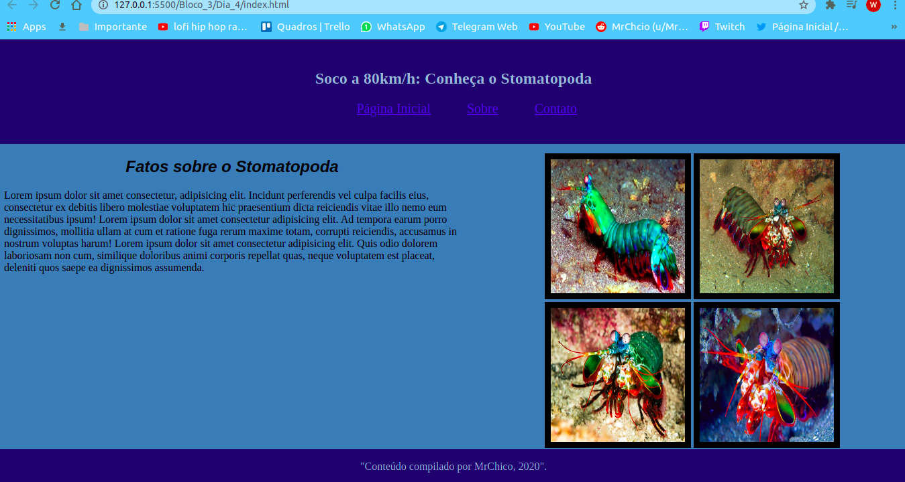

<h1 align="center">Bloco 3 Dia 4: HTML Semântico </h1>

  <a href="#exercicio">Exercícios do dia</a>&nbsp;&nbsp;|&nbsp;&nbsp;
  <a href="#descricao">Descrição dos exercícios</a>

 
<h2 id="exercicio">Exercícios do dia:</h2>

<li><a href="#stomatopodaSite">Criação do site do Stomatopoda.</a></li>
 

<h2 id="descricao">Descrição dos exercícios do dia:</h2>

<li id="stomatopodaSite"><a href="index.html">Criação do site do Stomatopoda.</a></li>

A atividade trata se da criação de um site sobre o animal stomatopoda, utilizando todos os conhecimentos adquiridos nos dias anteriores, foi possível a chegada do resultado a seguir:

