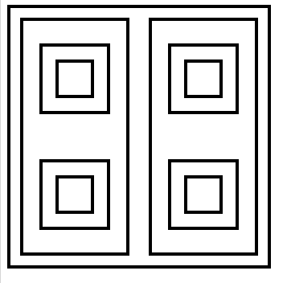
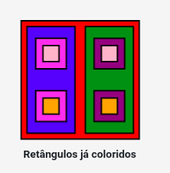
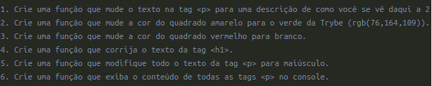

<h1 align="center">Bloco 5 Dia 1: Dom e Seletores</h1>

  <a href="#exercicio">Exercícios do dia</a>&nbsp;&nbsp;|&nbsp;&nbsp;
  <a href="#descricao">Descrição dos exercícios</a>

 
<h2 id="exercicio">Exercícios do dia:</h2>
<li><a href="#colorir">Colorir os quadrados.</a></li>
<li><a href="#exercicio">Modificar o site.</a></li>

 
<h2 id="descricao">Descrição dos exercícios do dia:</h2>

<li id="colorir"><a href="AtividadeQuadrado.html">Colorir os quadrados.</a></li>

A atividade trata-se de transformar os retângulo em preto e branco no retângulos coloridos utilizando os seletores segundo as imgens abaixo:

<li id="exercicio"><a href="exercício.html">Modificar o site.</a></li>

A atividade trata-se de modificar o site base, utilizando seletores, segundo os parâmetros apresentados abaico:

