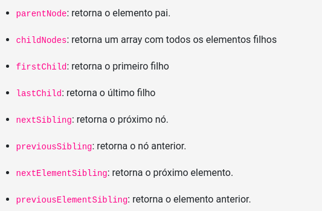

<h1 align="center">Bloco 5 Dia 2: Trabalhando com elementos</h1>

  <a href="#exercicio">Exercícios do dia</a>&nbsp;&nbsp;|&nbsp;&nbsp;
  <a href="#descricao">Descrição dos exercícios</a>

 
<h2 id="exercicio">Exercícios do dia:</h2>
<li><a href="#atividade1">Part 1.</a></li>
<li><a href="#atividade2">Part 2.</a></li>
<li><a href="#atividade3">Part 3.</a></li>
<li><a href="#exercicio">Modificar o site.</a></li>

 
<h2 id="descricao">Descrição dos exercícios do dia:</h2>

<li id="atividade1"><a href="AtividadeQuadrado.html">Treinar a busca de elementos.</a></li>

A atividade trata-se da busca pelos parentes de um elemento de um site já pronto feito pela <strong>Trybe</strong>. Comandos que podem ser utilizados: 

<li id="atividade2"><a href="AtividadeQuadrado.html">Treinar a criação de elementos.</a></li>

A atividade trata-se da criação de elementos de um site já pronto feito pela <strong>Trybe</strong>. Comandos utilizado: <strong>Variável.createElement("nome da tag");</strong>

<li id="atividade3"><a href="AtividadeQuadrado.html">Treinar a remoção de elementos.</a></li>

A atividade trata-se da remoção de elementos de um site já pronto feito pela <strong>Trybe</strong>. Comandos utilizado: <strong>Variável.removeChild("todo o elemento");</strong>

<li id="exercicio"><a href="exercício.html">Criação e modificação de um site.</a></li>

O exercício foi a fazer a criação de elementos, também modificar alguns elementos e por último remover alguns dos elementos.
