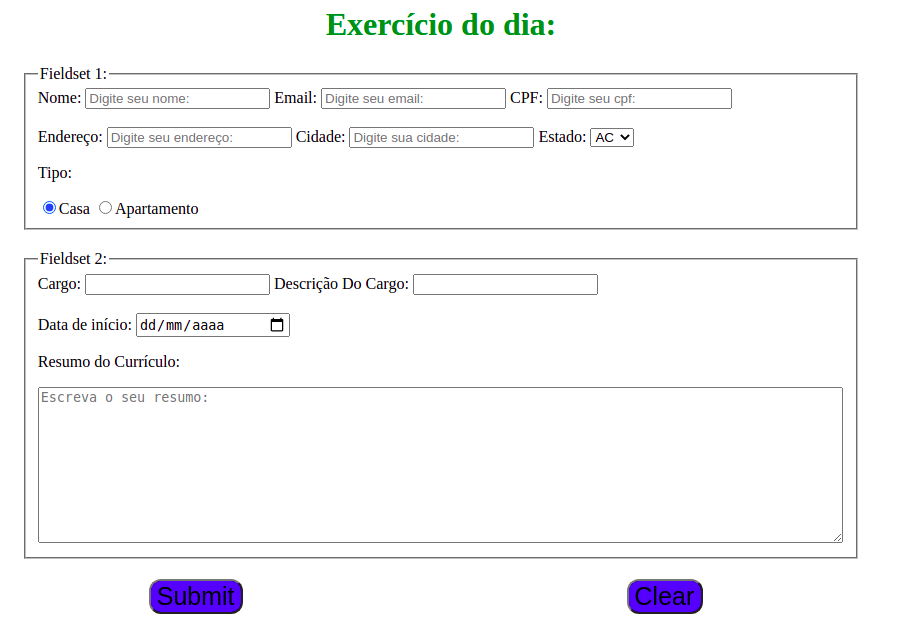

<h1 align="center">Bloco 6 Dia 1: HTMLS & CSS - Forms</h1>

  <a href="#exercicio">Exercícios do dia</a>&nbsp;&nbsp;|&nbsp;&nbsp;
  <a href="#descricao">Descrição dos exercícios</a>

 
<h2 id="exercicio">Exercícios do dia:</h2>

<li><a href="#part2">Exercício da Part 2: Site w3schools.com</a></li>
<li><a href="#formsCreation">Exercício do dia: Criar um forms.</a></li>

 
<h2 id="descricao">Descrição dos exercícios do dia:</h2>

<li id="part2">Exercício da Part 2: Site w3schools.com</li>

A atividade trata-se de melhorar os conhecimento no uso dos atributos e dos tipos da tag: INPUT.

<li id="formsCreation"><a href="form.html">Criar um forms.</a></li>

A atividade é a criação de um forms, utilizando propiedades como combobox, radiobuttons, fieldset e tag inputs.

