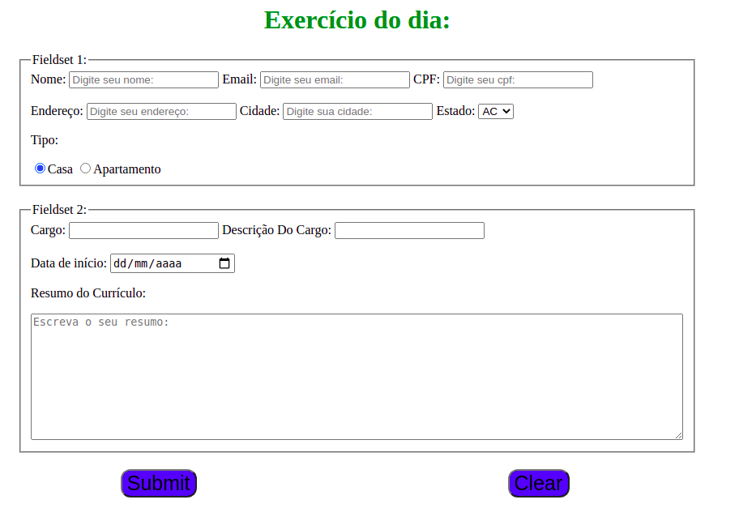
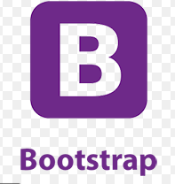
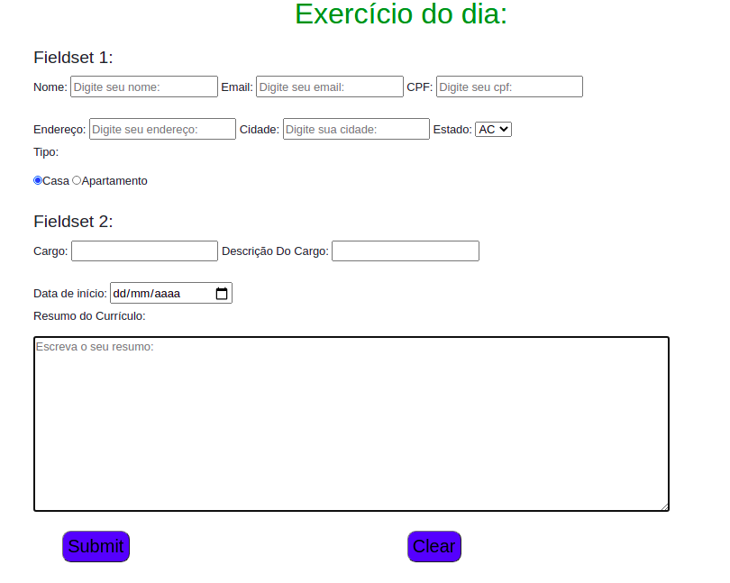

<h1 align="center">Bloco 6 Dia 2: Bibliotecas JavaScript e Frameworks CSS </h1>

  <a href="#exercicio">Exercícios do dia</a>&nbsp;&nbsp;|&nbsp;&nbsp;
  <a href="#descricao">Descrição dos exercícios</a>

 
<h2 id="exercicio">Exercícios do dia:</h2>

<li><a href="#atvDoDia">Atiidade do dia.</a></li>

 
<h2 id="descricao">Descrição dos exercícios do dia:</h2>

<li id="atvDoDia"><a href="form.html">Complemento do exercício anterior.</a></li>

Colocar um framework Css no exrcício do <a href="https://github.com/WendrickBarreto/Trybe/tree/Bloco6/Bloco_6/Dia_1">Bloco 6 no dia 1.</a>

